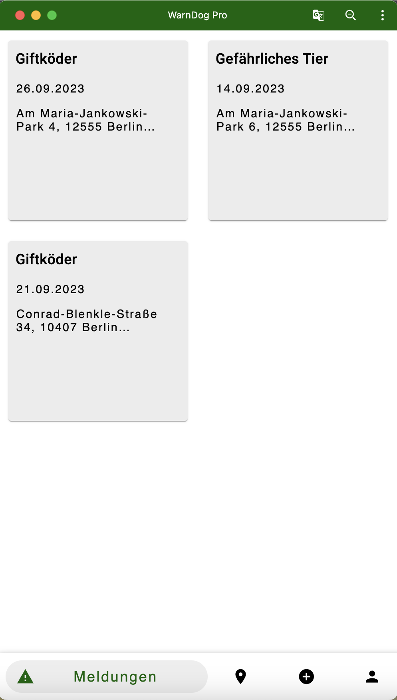
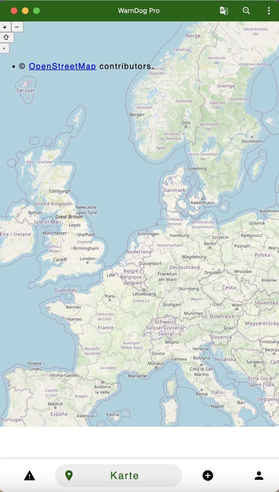
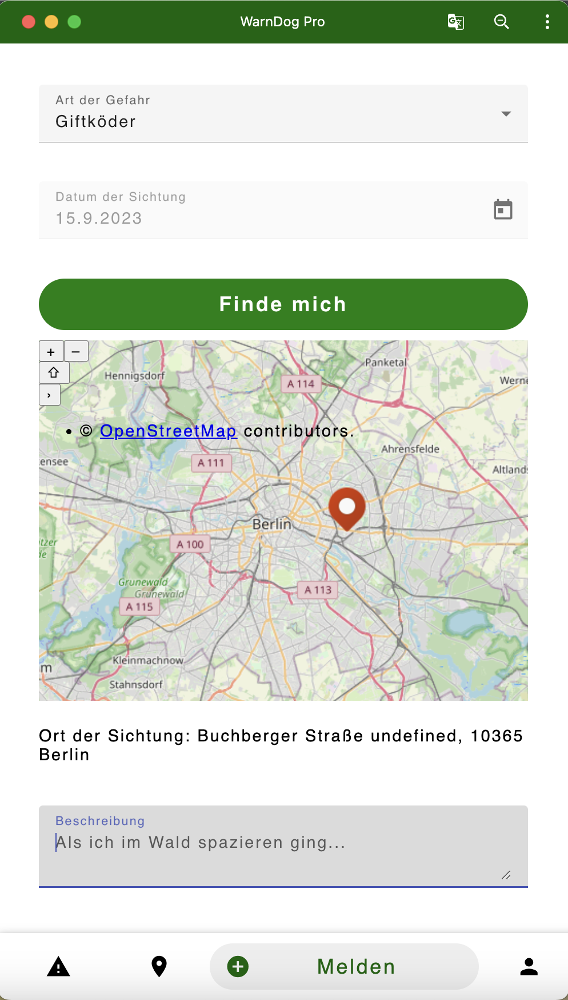
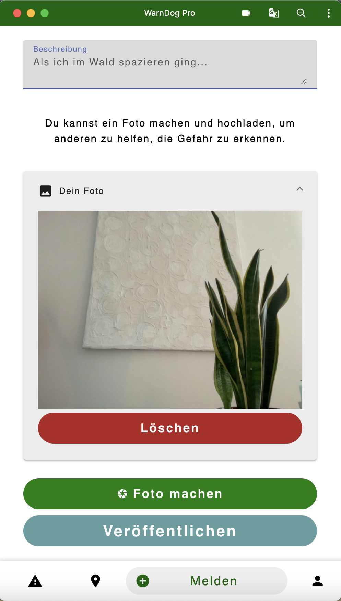
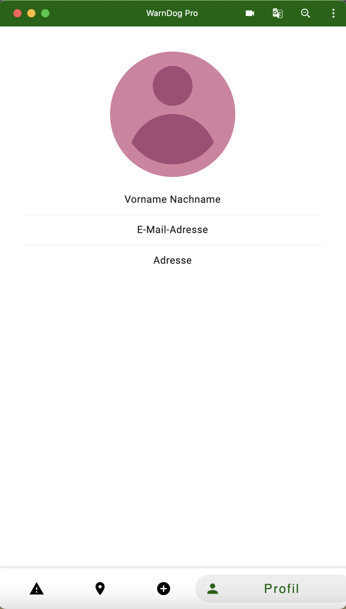

# WarnDog Pro

# 1. Technologien  
- Angular, NodeJs und MongoDB  
- ngx-webcam, um ein Foto zu machen  
- OpenLayers für die Abbildung einer Karte
    
    
# 2. Frontend starten  
Im frontend-Ordner:
   - npm install  
   - ng serve
       
       
# 3. Backend starten  
Im backend-Ordner:
   - npm install
   - npm run watch
    
    
# 4. Building the Project and starting http-Server  
   - ng build im frontend-Ordner
   - frontend/dist/frontend --> http-server -p 8081
       
       
# 5. Die Anwendung  
WarnDog Pro lässt Hundebesitzer Warnungen an andere Hundebsitzer schicken. 
Du findest beim Spaziergang mit deinem Hund einen Giftköder oder siehst einen anderen Hund ohne Besitzer? 
Melde es mit WarnDog Pro, um andere Menschen zu warnen und ihnen zu helfen.
    
    
# 5.1 Meldungen  
Der Startscreen ist die Übersicht aller verfassten Meldungen. 
Du siehst das Datum, den Ort und die Beschreibung der Meldung auf einen Blick.
    
    
   
    
    
# 5.2 Karte  
Die Karte soll später die Möglichkeit geben, alle gemeldeten Dinge auf einen Blick anzuzeigen.
    
    
   
    
    
# 5.3 Melden  
Hier kannst du selbst eine meldung verfassen. 
Um den Ort festzulegen, kannst du entweder deine eigene Position ermitteln oder frei wählbar auf der Karte einen Marker setzen.
    
    
   
    
    
Lade ein Foto von deiner Sichtung hoch, um anderen die Gefahr besser erkennbar zu machen.
    
    
   
    
    
# 5.4 Profil  
Das Profil soll später dazu dienen, dass du deine eigenen Meldungen angezeigt bekommst und bearbeiten kannst. 
Außerdam kannst du hier bald deine eigenen Daten überprüfen und bearbeiten.
    
    
   
    
    
# 6. Ausblick  
Wie oben beschieben, ist das Profil und die Karte ein Platzhalter für weitere Funktionen.
  